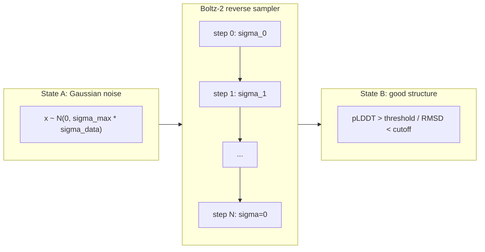
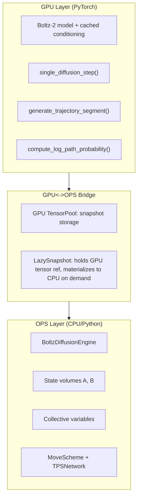

# Transition Path Sampling for Boltz-2 Reverse Diffusion

## Conceptual mapping

The Boltz-2 reverse sampler (EDM-style, in `[diffusionv2.py](boltz/src/boltz/model/modules/diffusionv2.py)`) is a **stochastic dynamical system** with known transition kernels. We treat it as the "engine" for classical TPS.

## Deliverable 1: Mathematical formulation (`docs/tps_diffusion_theory.tex`)

A self-contained TeX document. The theory is the most critical deliverable: it must be **rigorous** and handle the SE(3) augmentation and the discrete-time structure properly.

### Section 1 -- Setup and state space

Define the **extended** state at step `i` as:

- Atom coordinates: x_i \in \mathbb{R}^{M \times 3}
- Random rotation: R_i \in SO(3), drawn from Haar measure via `random_quaternions` -> `quaternion_to_matrix` (see `[utils.py](boltz/src/boltz/model/modules/utils.py)` lines 287-303)
- Random translation: \tau_i \in \mathbb{R}^{1 \times 3}, drawn from \mathcal{N}(0, s_\mathrm{trans}^2 I) (see `[compute_random_augmentation](boltz/src/boltz/model/modules/utils.py)` lines 46-53)
- Additive noise: \varepsilon_i \in \mathbb{R}^{M \times 3}
- Diffusion step index: i \in 0, 1, \ldots, L

The **"time" axis** is the diffusion step index, not physical time. States A and B are defined by collective variables on x_i at the endpoints.

### Section 2 -- Full transition kernel including SE(3) augmentation

From the Boltz-2 sampler loop (lines 350-528 of `diffusionv2.py`), each step consists of **three** sub-operations:

**Sub-step (a): SE(3) augmentation.** Center, then apply random rigid transform:

\tilde{x}_i = R_i \cdot (x_i - \bar{x}*i) + \tau_i, \qquad R_i \sim \mathrm{Haar}(SO(3)), \tau_i \sim \mathcal{N}(0, s*\mathrm{trans}^2 I)

**Sub-step (b): Noise injection.**

x_i^{\mathrm{noisy}} = \tilde{x}_i + \varepsilon_i, \qquad \varepsilon_i \sim \mathcal{N}(0, v_i I), \quad v_i = \eta^2 (\hat{t}*i^2 - \sigma*{i-1}^2)

where \hat{t}*i = \sigma*{i-1}(1 + \gamma_i) and \eta is `noise_scale`.

**Sub-step (c): Deterministic denoising update.**

D_i = f_\theta(c_\mathrm{in}(\hat{t}*i) \cdot x_i^{\mathrm{noisy}}, c*\mathrm{noise}(\hat{t}_i); \text{conditioning})

\hat{x}*i = c*\mathrm{skip}(\hat{t}*i) \cdot x_i^{\mathrm{noisy}} + c*\mathrm{out}(\hat{t}*i) \cdot D_i

x*{i+1} = x_i^{\mathrm{noisy}} + s \cdot (\sigma_i - \hat{t}_i) \cdot \frac{x_i^{\mathrm{noisy}} - \hat{x}_i}{\hat{t}*i}

where s is `step_scale` and f*\theta is the frozen score model.

The stochastic elements per step are (\varepsilon_i, R_i, \tau_i). Given these, the update is **deterministic**. The full transition kernel on the **extended** state (x, R, \tau, \varepsilon) is therefore a **product measure**:

p\bigl((x_{i+1}, R_i, \tau_i, \varepsilon_i) \mid x_i\bigr) = \mu_\mathrm{Haar}(R_i) \cdot \mathcal{N}(\tau_i; 0, s_\mathrm{trans}^2 I) \cdot \mathcal{N}(\varepsilon_i; 0, v_i I) \cdot \delta\bigl(x_{i+1} - T_i(x_i, R_i, \tau_i, \varepsilon_i)\bigr)

where T_i is the composite map (center, rotate, translate, add noise, denoise-update).

**Approach: Include SE(3) in the extended state (Option A).** We store (R_i, \tau_i) at each step alongside coordinates and noise. This is the **exact** treatment: the full path probability uses the complete kernel including augmentation, and no assumptions about the network's equivariance properties are needed.

**Why Option A:** Boltz-2's equivariance is **approximate** (finite-depth transformer, learned representations, numerical precision). Fixing R_i = I, \tau_i = 0 would assume **exact** equivariance, which may introduce subtle biases in path probabilities. Option A is rigorous regardless.

**Consequences for paths:** Successive frames are in **different SE(3) frames**. For analysis and visualization, we **post-align** paths (e.g., Kabsch alignment to a reference) after TPS, but the **sampling** itself works in the augmented frames. This is analogous to how MD trajectories in periodic boundary conditions are sampled in raw coordinates and post-processed for visualization.

**Consequences for acceptance ratios:** The Haar measure \mu_\mathrm{Haar}(R_i) is the **unique** bi-invariant measure on SO(3) and is **constant** (uniform) over the group. The translation density \mathcal{N}(\tau_i; 0, s_\mathrm{trans}^2 I) is isotropic. In the acceptance ratio of TPS, the SE(3) factors from old and new paths **cancel** whenever the shooting move resamples (R_i, \tau_i) fresh at each step (which it does, since the augmentation is i.i.d. per step). The net effect: acceptance ratios reduce to the same form as if only \varepsilon_i mattered, but the **paths themselves** faithfully include the augmentation.

**Consequences for backward shooting:** When shooting backward (re-noising), we must also **invert** the SE(3) step. Given (\tilde{x}_i, R_i, \tau_i), recover x_i = R_i^T (\tilde{x}_i - \tau_i) + \bar{x}_i. Since R_i is stored in the snapshot, this inversion is exact.

The TeX document will present the full derivation with SE(3) included, show the cancellation in acceptance ratios, and also note as a remark that Option B (fixing R_i = I) is valid under exact equivariance for readers who want the simpler formulation.

### Section 3 -- Path probability (Option A, full SE(3))

The **full** path in the extended state space is:

\mathcal{X} = \bigl(x_0, R_0, \tau_0, \varepsilon_0), (x_1, R_1, \tau_1, \varepsilon_1), \ldots, (x_L)\bigr

The path probability is:

P(\mathcal{X}) = \rho(x_0) \prod_{i=0}^{L-1} \bigl[\mu_\mathrm{Haar}(R_i) \cdot \mathcal{N}(\tau_i; 0, s_\mathrm{trans}^2 I) \cdot \mathcal{N}(\varepsilon_i; 0, v_i I)\bigr]

subject to the deterministic constraint x_{i+1} = T_i(x_i, R_i, \tau_i, \varepsilon_i) at each step.

**Log path probability decomposition:**

\log P(\mathcal{X}) = \log \rho(x_0) + \sum_{i=0}^{L-1} \bigl[\log \mu_\mathrm{Haar}(R_i) + \log \mathcal{N}(\tau_i) + \log \mathcal{N}(\varepsilon_i) + \log |\det J_i|\bigr]

**Term-by-term:**

- **Haar term:** \log \mu_\mathrm{Haar}(R_i) is the same constant for all rotations (Haar is uniform on SO(3)). In acceptance ratios, these terms **cancel** between old and new paths.
- **Translation term:** \log \mathcal{N}(\tau_i; 0, s_\mathrm{trans}^2 I) = -\tau_i^2 / (2 s_\mathrm{trans}^2) + \mathrm{const}. Since \tau_i is **resampled fresh** in each shooting move (i.i.d. per step), the forward and reverse generation probabilities are equal and these also **cancel** in the acceptance ratio.
- **Noise term:** \log \mathcal{N}(\varepsilon_i; 0, v_i I) = -\varepsilon_i^2 / (2 v_i) + \mathrm{const}. This is the **main** contribution that does **not** cancel in general.
- **Jacobian term:** J_i = \partial x_{i+1} / \partial \varepsilon_i. Since the update is affine in \varepsilon_i (the network output does not depend on \varepsilon_i through a second derivative), J_i is a **scalar multiple** of the identity: |\det J_i| = |1 + s(\sigma_i - \hat{t}_i)/\hat{t}_i|^{3M}. This is a **known constant per step** (depends only on the schedule, not on coordinates).

**Practical upshot for acceptance ratios:** The **only** non-cancelling contribution is the **noise log-density** -\varepsilon_i^2 / (2v_i), summed over the steps that differ between old and new paths. The Haar and translation terms cancel. The Jacobian terms cancel (same schedule for old and new). Computing \varepsilon_i requires one network call per step (to determine the denoised prediction from the forward map), which is the same cost as running the sampler.

**Recovering \varepsilon_i from a stored path:** Given (x_i, R_i, \tau_i, x_{i+1}), the noise is recovered by inverting the deterministic map: compute the centered-rotated-translated coordinates \tilde{x}_i = R_i \cdot (x_i - \bar{x}*i) + \tau_i, then solve x*{i+1} = \tilde{x}_i + \varepsilon_i + s(\sigma_i - \hat{t}_i)(\tilde{x}_i + \varepsilon_i - \hat{x}_i)/\hat{t}_i for \varepsilon_i. Since this is affine in \varepsilon_i, the solution is a closed-form linear expression.

**Remark:** Under exact SE(3) equivariance, one can equivalently fix R_i = I, \tau_i = 0 (Option B) and obtain the same marginal path distribution. The TeX document will include this as a simplification for readers who prefer it.

### Section 4 -- SDE equivalent and discrete-time Markov chain perspective

**Can we write an SDE?** The Boltz-2 sampler is **not** a standard Euler-Maruyama discretization of a known SDE. The EDM preconditioning (c_\mathrm{skip}, c_\mathrm{out}, c_\mathrm{in}, c_\mathrm{noise}) and the \sigma-schedule with \gamma-injection and `step_scale` create a **non-standard** integrator. In principle, one could reverse-engineer a **formal** SDE whose EM discretization matches the sampler, but:

- The network f_\theta is a **black box** (not a smooth vector field in the PDE sense).
- The \sigma-schedule is **non-uniform** in "time" (power-law spacing controlled by \rho).
- The `step_scale` parameter further warps the effective step size.

**Formal SDE (with caveats).** If we define a continuous "time" t via the sigma schedule and absorb the preconditioning into a drift b(x, t) and diffusion g(t), we can write:

dx = b(x, t)dt + g(t)dW_t

where b encodes the denoiser update and g encodes the noise injection. The TeX document will derive this formal correspondence and note where it breaks down (primarily: the drift is a neural network, not a smooth field; the discretization is specific, not a generic EM step).

**Discrete-time fallback (rigorous).** Even without a clean SDE, TPS is **perfectly well-defined** for discrete-time Markov chains. As shown by Mora, Walczak, and Zamponi ([arXiv:1202.0622](https://arxiv.org/abs/1202.0622)), TPS applies to any stochastic process with:

- A well-defined transition kernel p(x_{i+1} | x_i)
- The ability to compute path probability ratios

Our process satisfies both. The Boltz-2 sampler is a **continuous-state, discrete-time, inhomogeneous Markov chain** (the kernel changes at each step because \sigma changes). The TeX document will present TPS in this general discrete-time framework, noting that:

- The Falkner et al. ([arXiv:2408.03054](https://arxiv.org/abs/2408.03054)) extended-ensemble formalism applies directly.
- The acceptance criterion (Eq. 6 of Falkner et al.) holds for any process where path probabilities are products of transition kernels, regardless of whether those kernels come from an SDE discretization.
- The formal SDE is a **bonus** for intuition, not a requirement.

### Section 5 -- TPS in the extended ensemble

Following Falkner et al., define the extended space Y = (X, k) with shooting index k. For **fixed-length** paths (fixed number of diffusion steps = `num_sampling_steps`), the acceptance criterion is:

p_\mathrm{acc}[(X^\mathrm{o}, k^\mathrm{o}) \to (X^\mathrm{n}, k^\mathrm{n})] = H_{AB}(X^\mathrm{n}) \min\Bigl[1, \frac{L(X^\mathrm{o})}{L(X^\mathrm{n})}\Bigr]

For fixed-length paths, L(X^\mathrm{o}) = L(X^\mathrm{n}), so acceptance = reactivity check only: does X^\mathrm{n} start in A and end in B?

**Crucial subtlety for non-time-reversible dynamics:** The Boltz-2 sampler is **not** time-reversible (it is a directed noise-to-structure process, not an equilibrium dynamics with detailed balance). In classical TPS with time-reversible dynamics, backward shooting uses velocity reversal and the path probability ratio cancels. Here:

- **One-way shooting** (forward only) avoids the need for a backward kernel entirely. From shooting point k, keep x_0, \ldots, x_k and shoot forward with fresh noise. This is always valid.
- **Two-way shooting** requires defining a backward process. We use the **forward diffusion** (noising) as the backward kernel, with an explicit path probability ratio in the acceptance. The TeX will derive this ratio.

### Section 6 -- Shooting moves for diffusion

- **Forward shooting** from step k: keep x_0, \ldots, x_k from the old path; optionally perturb x_k \to x_k + \delta with \delta \sim \mathcal{N}(0, \sigma_\mathrm{pert}^2 I); resample fresh noise \varepsilon_k, \ldots, \varepsilon_{L-1} and propagate forward through the sampler. Accept if the new path connects A to B.
- **Backward shooting** from step k: keep x_k, \ldots, x_L from the old path; propagate backward (toward higher \sigma) by **re-noising**: at each backward step, sample noise consistent with the forward diffusion kernel. The acceptance ratio includes the path probability ratio:

\frac{P(X^\mathrm{n})}{P(X^\mathrm{o})} = \frac{\prod_{i=0}^{k-1} p^\mathrm{bwd}(x_{i}^\mathrm{n} | x_{i+1}^\mathrm{n})}{\prod_{i=0}^{k-1} p^\mathrm{fwd}(x_{i+1}^\mathrm{o} | x_i^\mathrm{o})} \cdot \frac{\rho(x_0^\mathrm{n})}{\rho(x_0^\mathrm{o})}

where p^\mathrm{bwd} is the re-noising kernel. Since both kernels are Gaussian, this ratio is a **sum of quadratic forms** -- cheap to compute.

- **Perturbation at the shooting point**: For moderate-dimensional systems, a small Gaussian perturbation \delta x at the shooting point increases decorrelation between successive paths.

### Section 7 -- Collective variables for diagnostics

Define CVs on the intermediate structures:

- RMSD to a reference structure
- Radius of gyration
- Contact maps / contact order
- pLDDT of the \hat{x}_0-prediction at each step (measures model confidence)
- Attention entropy from the network at each step
- Step index itself (as a "reaction coordinate" analog)

## Deliverable 2: GPU-native OPS engine wrapper

### Architecture

The critical performance constraint is that **Boltz-2 runs on GPU** and each trial trajectory requires multiple network forward passes. Moving tensors to CPU for OPS at every step would be prohibitively slow. The design uses a **two-layer architecture**:

### File structure under `src/python/tps_boltz/`

- `gpu_core.py` -- Pure PyTorch, no OPS dependency:
  - `BoltzSamplerCore`: wraps Boltz-2 model, caches conditioning, exposes `single_step(x, step_idx) -> (x_next, eps, R, tau)` and `generate_segment(x_start, start_idx, end_idx) -> trajectory`
  - `compute_log_path_prob(trajectory) -> float`
  - All ops stay on GPU; no `.cpu()` calls
- `snapshot.py` -- Custom OPS snapshot class:
  - Stores `(atom_coords, step_index, sigma, eps_used, rotation_R, translation_t)` as **GPU tensors** internally
  - Implements `coordinates` property that lazily calls `.cpu().numpy()` only when OPS needs it for storage/serialization
  - `reversed` property constructs the appropriate reversed snapshot
- `engine.py` -- `BoltzDiffusionEngine(DynamicsEngine)`:
  - `generate_next_frame()`: calls `BoltzSamplerCore.single_step`, returns `LazySnapshot`
  - Direction handling: `+1` = denoise, `-1` = re-noise
  - Batched trajectory generation: override `generate_n_frames` to run multiple steps on GPU without round-tripping
- `states.py` -- State volume definitions (A = high-sigma noise, B = quality filter). CV evaluation happens on GPU.
- `collective_variables.py` -- CVs evaluated as GPU functions:
  - RMSD (via `weighted_rigid_align` already in Boltz), Rg, pLDDT-of-denoised-prediction, step index
  - Results cached on GPU, transferred to CPU only for OPS histogram/analysis
- `path_probability.py` -- `compute_log_path_prob` for full paths including SE(3) terms
- `utils.py` -- Boltz-2 model loading, conditioning cache, sigma schedule helpers

### Batched trial trajectories

For efficiency, the engine should support **generating multiple trial trajectories in parallel** on GPU (Boltz-2 already supports `multiplicity` for batched sampling). The OPS `PathSimulator` calls will be wrapped to batch shooting moves:

- N shooting points selected
- N forward segments generated in one batched `generate_segment` call
- Results unpacked into N OPS `Sample` objects

This avoids the serial overhead of OPS's default one-at-a-time path generation.

## Deliverable 3: Orchestration script (`scripts/run_tps_boltz.py`)

A script that:

1. Loads Boltz-2 with a given YAML input and checkpoint onto GPU
2. Computes and caches conditioning tensors (trunk, MSA, pair representations)
3. Runs one full forward trajectory (initial path) to seed TPS
4. Sets up OPS `FixedLengthTPSNetwork` with the engine, state definitions, and shooting scheme
5. Runs TPS for N rounds, storing trajectories (GPU tensors serialized to disk)
6. Outputs trajectory data for downstream analysis (path probabilities, CVs, shooting point statistics)

## Key technical risks and mitigations

- **Cost**: Each trial trajectory requires ~5-20 Boltz-2 network calls (one per remaining diffusion step). Mitigation: use `num_sampling_steps=5` (Boltz-2 default) to keep paths short; batch multiple trials on GPU; use one-way shooting to halve the average number of steps per trial.
- **SE(3) augmentation**: Boltz-2 applies random rotations/translations at each step (lines 351-357 of `diffusionv2.py`). We use **Option A**: include (R_i, \tau_i) in the extended state. The Haar and translation terms cancel in acceptance ratios (proven in theory Section 3), so the computational cost is just storing the rotation matrix and translation vector per snapshot. Post-alignment is needed for visualization.
- **Backward shooting well-definedness**: The re-noising kernel must be defined carefully. The forward diffusion (noising) is x_\mathrm{noisy} = x + \sigma \cdot z which is simple. But the Boltz-2 reverse step is **not** the exact time-reversal of a known SDE, so backward shooting requires an **explicit** backward kernel and an **explicit** acceptance ratio correction. The TeX will derive this.
- **SDE vs discrete-time**: The Boltz-2 sampler is not a standard SDE discretization. Per Mora et al. ([arXiv:1202.0622](https://arxiv.org/abs/1202.0622)), TPS applies to **any** discrete-time Markov process, so this is not a fundamental obstacle. The formal SDE correspondence is derived for intuition only.
- **OPS GPU compatibility**: OPS is CPU/NumPy-native. The `LazySnapshot` pattern and GPU tensor pool avoid constant device transfers. OPS's serialization (NetCDF) will receive CPU arrays only at checkpoint time.

